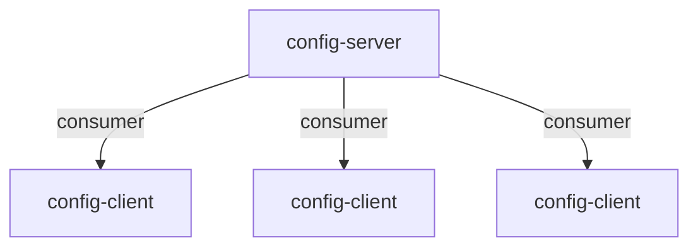

# config-server


This is a config server. It is a spring boot application that provides configuration for other microservices services.
Explore more about spring config server on the [Wiki](https://docs.spring.io/spring-cloud-config/docs/current/reference/html/) and [Wiki](https://cloud.spring.io/spring-cloud-config/multi/multi__spring_cloud_config_server.html) for more information.

The config server can pull the data from different source like:
- Git
- File System
- Vault
- JDBC

Let's assume out **Git**  repository contain configuration file like this:

```shell
.
├── application.yml
├── nginx.conf
├── ms1.yml
├── ms2.yml
└── spa.json
```

Start the application
> Before start , Make sure , you have the correct github URL in the `application.yml` file.

```shell
mvn spring-boot:run
```
Supported endpoint to explore the config-server are as follows:

Available Endpoints
```shell
/{application}/{profile}[/{label}] 
"application" = ${spring.application.name}
"profile" = ${spring.profiles.active} (actually Environment.getActiveProfiles())
"label" = "master"
```
`[/{label}]` cab ne
```shell
/{application}-{profile}.yml #http://localhost:8888/config-server/development/main/application.yml
/{label}/{application}-{profile}.yml
/{application}-{profile}.properties
/{label}/{application}-{profile}.properties 
```

Example
```http
# application.yml
http://localhost:8888/config-server/default

# application-dev.yml
http://localhost:8888/config-server/dev

#config-client.yml
http://localhost:8888/config-server/default/main/config-client.yml
http://localhost:8888/config-client/default/main

#config-client-dev.yml
http://localhost:8888/config-server/dev/main/config-client.yml
http://localhost:8888/config-client/dev/main

#spa.json
http://localhost:8888/config-server/defaultt/main/spa.json

http://localhost:8888/spa/default/main
http://localhost:8888/spa/default/main/spa.json

http://localhost:8888/config-client/default/main/spa.json
http://localhost:8888/config-client/development/main/spa.json
```